# ANIMAIS FANTASTICOS

🐻🐒🐼🐱🦊🐰

## índice

- <a href="#videos">Videos do projeto</a>
- <a href="#layout">Layout</a>
- <a href="#Demonstracao">Demonstraçao</a>
- <a href="#rodar">Como rodar o projeto?</a>
- <a href="#tecnologias">Tecnologias Utilizadas</a>
- <a href="#autor">Autor</a>

## Videos
Mobile:
https://github.com/Emilio-Jose-Camilo/animais-fantasticos/assets/121612644/127cee7f-d4d6-4675-b390-eeb9b19ef50f

Desktop:
https://github.com/Emilio-Jose-Camilo/animais-fantasticos/assets/121612644/415433b4-e8e1-4e51-bcbf-66f834f977d8


## Layout

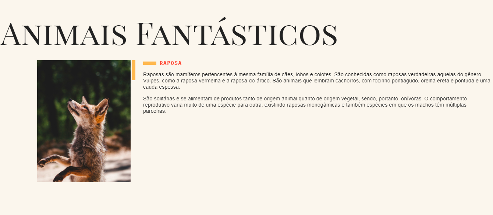
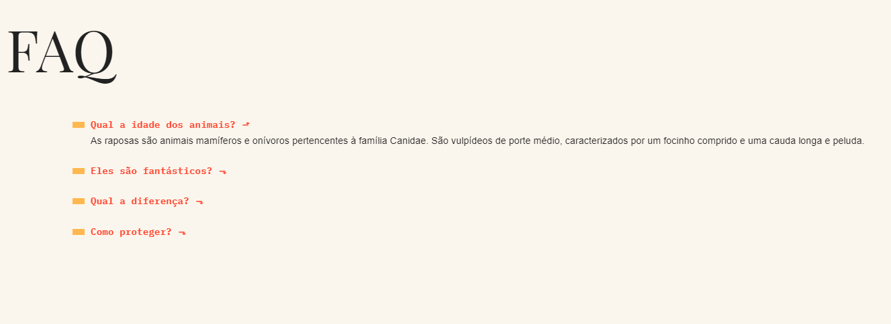
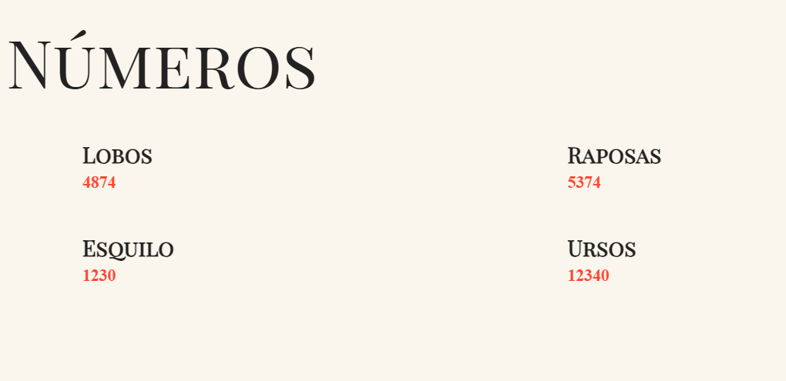
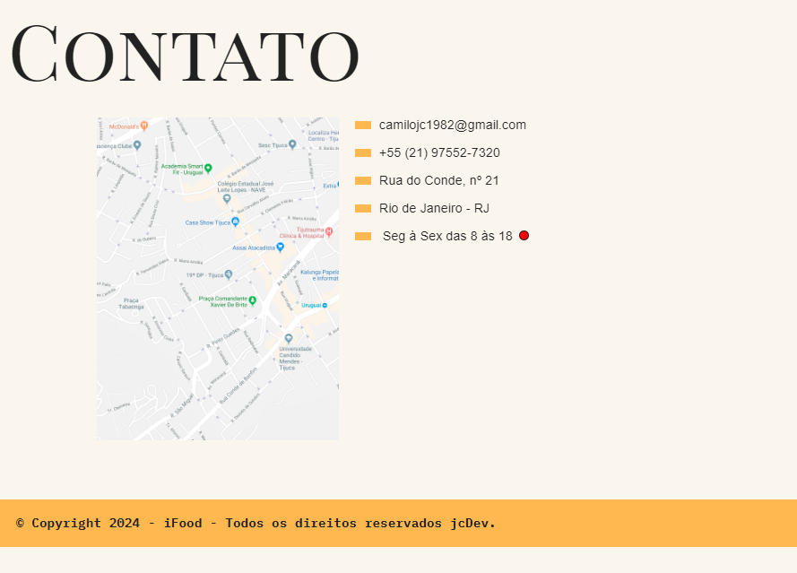
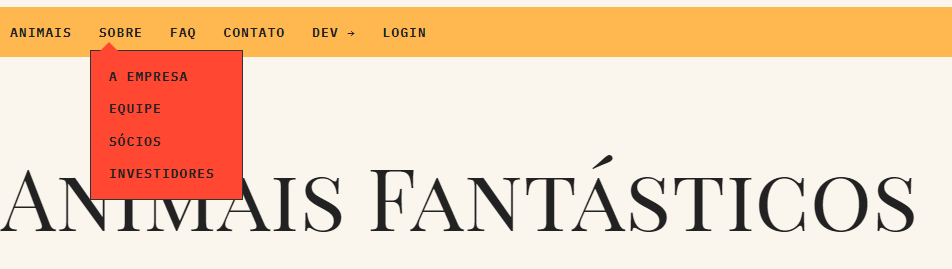
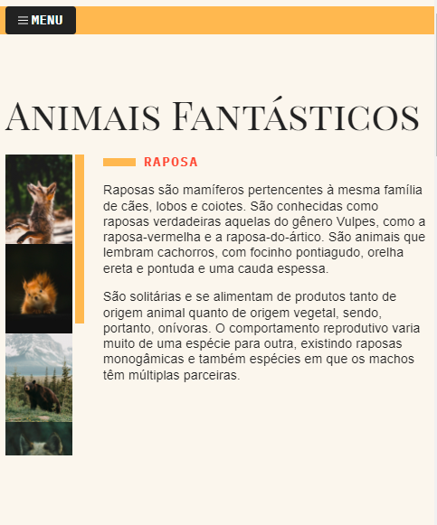
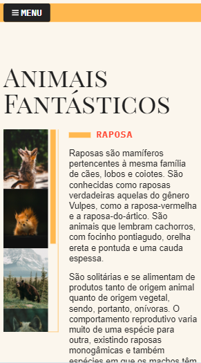
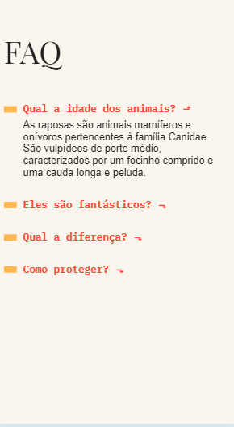
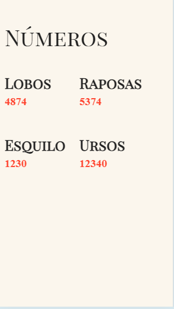
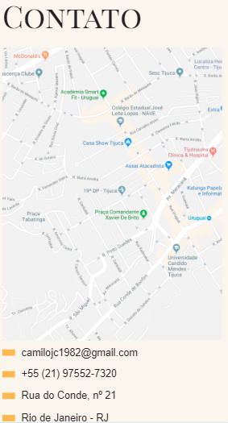
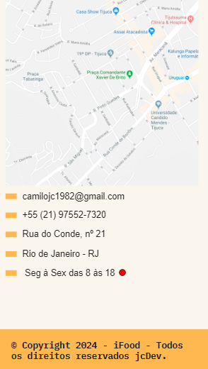

## Demonstraçao

[Link demonstração](https://emilio-jose-camilo.github.io/)

## Como rodar o projeto?

```bash
# Clone este repositório
$ git clone linkrepo
# Acessa a pasta do projeto no seu teminal
$ cd brafe
# Execute a aplicação com a extensão open with live server
$ clique no canto canto inferior da janela do vscode
```

## 🛠Tecnologias Utilizadas

1. [html](https://developer.mozilla.org/pt-BR/docs/Web/HTML)
2. [css](https://developer.mozilla.org/pt-BR/docs/Web/CSS)
3. [javaScript](https://developer.mozilla.org/pt-BR/docs/Web/JavaScript)
4. [EsLint](https://eslint.org/)

## Autor


[linkedIn](https://www.linkedin.com/in/emilio-jos%C3%A9-794955208/)
